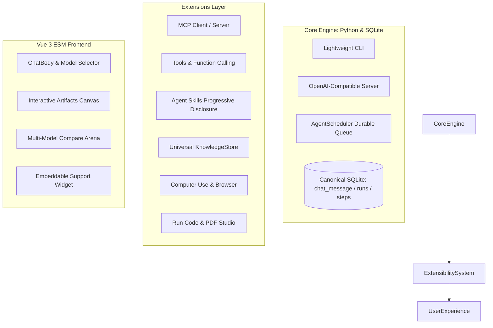

# AI Assistant Roadmap & Feature Recommendations (`FUTURE.md`)

## Executive Summary

`llms.py` (also known as `llmspy` / `AI.Chat`) has evolved into a formidable, privacy-first alternative to Open WebUI and commercial LLM interfaces. Its distinct architectural edge lies in:
1. **Minimalist, Zero-Bloat Core**: Pure Python standard library with a single external dependency (`aiohttp`).
2. **Durable Agent Architecture**: The [`AgentScheduler`](llms/extensions/app/__init__.py) in `llms/extensions/app` provides asynchronous background runs, leased worker queues, slice boundaries, non-destructive context compaction, and append-oriented canonical message storage (`chat_message`).
3. **Pluggable Architecture**: ComfyUI-style server hooks (`__install__`, `__parser__`, `__run__`) combined with native ES module (ESM) Vue 3 component slots without build step complexity.
4. **Broad Catalog & Offline First**: Access to 530+ models from 23 providers via models.dev, local Ollama/LMStudio support, and local SQLite data isolation.

This document outlines high-impact feature recommendations designed to expand `llms.py` into an autonomous agent platform, provider-agnostic RAG engine, and turnkey enterprise AI assistant.

---

## 1. Architectural Foundations

---

## 2. Strategic Feature Recommendations

### Priority 1: Agentic & Ecosystem Interoperability

#### 1.1 Model Context Protocol (MCP) Client & Server Support
* **Background**: Anthropic's open Model Context Protocol (MCP) has established itself as the standard for connecting LLMs to external tools, databases, and enterprise services (PostgreSQL, GitHub, Slack, Brave Search, local filesystems).
* **Feature Scope**:
  - **MCP Client Extension (`extensions/mcp/`)**: Connect to local `stdio` processes and remote `SSE` / HTTP MCP servers configured in `~/.llms/mcp_config.json`.
  - **Dynamic Tool Discovery**: Translate MCP tool definitions automatically into `llms.py` tool groups (`ctx.app.tool_groups["mcp"]`), maintaining the existing function signature format.
  - **Reverse MCP Server**: Expose `llms.py`'s built-in tools, registered skills, and file search stores as an MCP server, allowing IDEs (Cursor, Claude Desktop, Antigravity, VS Code) to leverage `llms.py` capabilities.

#### 1.2 Interactive Human-in-the-Loop (HITL) Tool Approval Gates
* **Background**: Autonomous agents executing shell scripts (`run_bash`), Python files, or destructive filesystem edits require user oversight to prevent unintended system actions.
* **Feature Scope**:
  - **Policy-Based Approvals**: Agent profile configs (`config.json`) define per-tool safety policies (`auto`, `always_ask`, `deny`).
  - **Scheduler Pause State**: The `AgentScheduler` suspends execution at an `awaiting_approval` state, checkpointing the run to SQLite without keeping connections open.
  - **Interactive Action Cards**: In `ChatBody.mjs`, render an approval dialog displaying exact command arguments and diffs with options to **Approve**, **Reject**, or **Edit Arguments**.

#### 1.3 Subagent Delegation & Multi-Agent Swarms
* **Background**: Current agent profiles (`chat`, `coder`, `planner`) transition sequentially through manual footer actions. Complex workflows benefit from supervisor agents spawning isolated child agents.
* **Feature Scope**:
  - **`spawn_subagent(profile, task, timeout_slices)` Tool**: Allows a parent planner or coder to spin off specialized worker tasks.
  - **Context Isolation**: Subagents run within their own bounded `agent_run` in SQLite. Intermediate noise (shell output, raw HTTP bodies) stays inside the child run, and only the distilled summary is returned to the parent agent.
  - **Parallel Task Execution**: The scheduler claims multiple child tasks concurrently up to `maxConcurrency`.

---

### Priority 2: Universal Knowledge & RAG Architecture

#### 2.1 Universal Offline `KnowledgeStore` (Local Vector Search)
* **Background**: The current RAG extension (`llms/extensions/gemini`) relies exclusively on Google's cloud-based File Search API. This breaks the "offline-first, total privacy" promise when users run local models via Ollama or LMStudio.
* **Feature Scope**:
  - **`KnowledgeStore` Provider Abstraction**: Define a unified interface for document stores: `create_store()`, `upload_doc()`, `search()`, `delete_doc()`, and `sync()`.
  - **Local SQLite-Vec / Cosine Index Backend**: Implement a zero-external-dependency local vector store using `sqlite-vec` or a lightweight numpy/cosine similarity index over embeddings generated via Ollama (`nomic-embed-text`) or OpenAI-compatible endpoints.
  - **Unified RAG UI**: Reuse the existing store list, category management, document status grids, and citation rendering across both cloud (Gemini) and local backends.

#### 2.2 Automated Ingestion Engine (Git Repo & Web Crawler Sync)
* **Background**: Adding documents currently requires manual file uploads (`POST /upload`). Teams and organizations need hands-off ingestion that tracks updates automatically.
* **Feature Scope**:
  - **Git Repo Synchronization**: Point a store at a local directory or remote Git repository (`https://github.com/org/docs`). Ingest `**/*.md`, map directories to categories, track commit hashes, and automatically tombstone deleted files on refresh.
  - **Sitemap & Web Crawler**: Use the zero-dependency `HTMLToMarkdownParser` from `core_tools` to crawl `sitemap.xml` feeds, stripping navigation boilerplate and populating clean Markdown with canonical `sourceUrl` metadata.

#### 2.3 Turnkey Support Assistant & Embeddable Widget
* **Background**: Organizations want to deploy their indexed knowledgebase as a customer-facing support assistant on external websites.
* **Feature Scope**:
  - **Published Assistant Entity**: A database entity binding store(s) + model + persona + metadata filters (`audience=public`) + rate limits + CORS allowed origins.
  - **Lightweight Shadow DOM Widget (`widget.js`)**: A ~10KB dependency-free script tag (``) rendering a floating chat launcher isolated from host CSS.
  - **Zero-Grounding Guardrails & Feedback**: Answers without matching document chunks fall back to "Not found in docs" with an optional human escalation webhook, logging unanswered queries into a content-gap analytics dashboard.

---

### Priority 3: Interactive UI & Developer Experience

#### 3.1 Side-by-Side Artifacts & Canvas Workspace
* **Background**: Claude Artifacts and OpenAI Canvas demonstrate the power of separating live outputs from the linear chat stream.
* **Feature Scope**:
  - **Live Web Sandbox**: Render generated HTML/JS/CSS, SVG graphics, and Vue components in a sandboxed, responsive side-panel with an interactive viewport switcher (desktop/tablet/mobile).
  - **Side-by-Side Diff Inspector**: When coding agents modify project files, present a syntax-highlighted unified/split diff viewer with one-click "Apply Changes" or "Revert".
  - **Mermaid & Diagram Renderer**: Automatic real-time rendering of architecture diagrams, flowcharts, and sequence diagrams directly in the canvas.

#### 3.2 Multi-Model Arena & Prompt Comparison
* **Background**: `llms.py` has access to 530+ models from 23 providers. Side-by-side model benchmarking is one of the most compelling reasons developers use multi-model tools.
* **Feature Scope**:
  - **Parallel Prompt Dispatch**: Select 2 to 4 models simultaneously (e.g., Claude 3.7 Sonnet, GPT-4o, Gemini 2.5 Pro, and DeepSeek R1) and stream responses in parallel columns.
  - **Live Performance Telemetry**: Display time-to-first-token (TTFT), tokens per second, total token count, and calculated dollar cost per response.

#### 3.3 Branching Conversation Trees & Message Forking
* **Background**: The canonical `chat_message` schema already contains an `active` boolean column, designed to preserve alternate branches.
* **Feature Scope**:
  - **Branch Switching UI**: Expose navigation controls (`< 1/3 >`) under edited user prompts and assistant responses.
  - **Non-Destructive Forking**: Editing an earlier message branches history forward, allowing users to explore different prompt variations without losing earlier generation results.

---

### Priority 4: Real-Time Multimodal & Voice

#### 4.1 Real-Time Full-Duplex Voice Chat
* **Background**: The current voice extension performs turn-based Speech-to-Text and Text-to-Speech sequentially.
* **Feature Scope**:
  - **WebRTC / WebSocket Streaming**: Support the Gemini Multimodal Live API and OpenAI Realtime API for natural voice interaction.
  - **Client-Side Barge-In Detection**: Visualizer with real-time audio detection that interrupts model speech playback immediately when the user starts talking.

#### 4.2 Video Scrubbing & Multimodal Timestamps
* **Background**: Multimodal models can analyze full `.mp4` and `.webm` video recordings.
* **Feature Scope**:
  - Direct video uploads in chat with inline player support.
  - Clickable timestamp citations (e.g., `[01:42]`) in model responses that automatically seek the video player to the referenced segment.

---

### Priority 5: Enterprise, Security & Collaboration

#### 5.1 Team Workspaces & Role-Based Access Control (RBAC)
* **Background**: Auth currently resolves to either an anonymous shared scope (`user IS NULL`) or private user folders.
* **Feature Scope**:
  - **Workspaces**: Introduce `Personal`, `Team`, and `Public` scopes for threads, agent profiles, and filestores.
  - **Roles**: `Admin` (manages keys, ingestion, and team quotas), `Member` (creates threads and tools), and `Viewer` (queries published assistants only).

#### 5.2 Per-User Secrets Vault & Bring-Your-Own-Key (BYOK)
* **Background**: API keys currently reside in global server environment variables or `.env`.
* **Feature Scope**:
  - Per-user credential vault in the settings dialog, storing encrypted user API keys in SQLite. Allows multi-user teams to bill against their individual provider accounts.

#### 5.3 Cost & Spend Budgeting Safeguards
* **Background**: Long-running autonomous agent loops can inadvertently run up large API costs.
* **Feature Scope**:
  - Hard and soft budget limits per user/workspace (e.g., daily token thresholds, spend caps).
  - Configurable auto-pause when thresholds are reached.

---

## 3. Phased Implementation Roadmap

| Phase | Strategic Goal | Core Components & Extensions | Deliverables |
|---|---|---|---|
| **Phase 1** | **Ecosystem & Standards Leadership** | `llms/extensions/mcp/`, `llms/extensions/tools/`, `llms/extensions/app/` | • MCP Client and Server • Human-in-the-Loop tool approvals • Subagent delegation tool (`spawn_subagent`) |
| **Phase 2** | **Universal Knowledge & Ingestion** | `llms/extensions/gemini/`, `llms/extensions/core_tools/`, new `knowledge/` | • Provider-agnostic `KnowledgeStore` interface • Local vector search (SQLite-Vec / Ollama embeddings) • Git repo and sitemap crawler ingestion |
| **Phase 3** | **Developer Power Tools** | `llms/ui/modules/chat/`, `llms/ui/App.mjs`, `llms/ui/ctx.mjs` | • Side-by-Side Artifacts & Canvas panel • Multi-Model Arena comparison view • Conversation tree branching (`chat_message.active`) |
| **Phase 4** | **Turnkey Distribution & Embeds** | `llms/extensions/gemini/`, `llms/extensions/publish/` | • Public Assistant entity with CORS & rate-limiting • Zero-dependency Shadow DOM chat widget (`widget.js`) • Content-gap analytics dashboard |
| **Phase 5** | **Real-Time Multimodal & Enterprise** | `llms/extensions/voice/`, `llms/main.py`, `llms/extensions/app/` | • WebRTC full-duplex voice streaming • Team workspaces & RBAC • Per-user API key vault (BYOK) |
