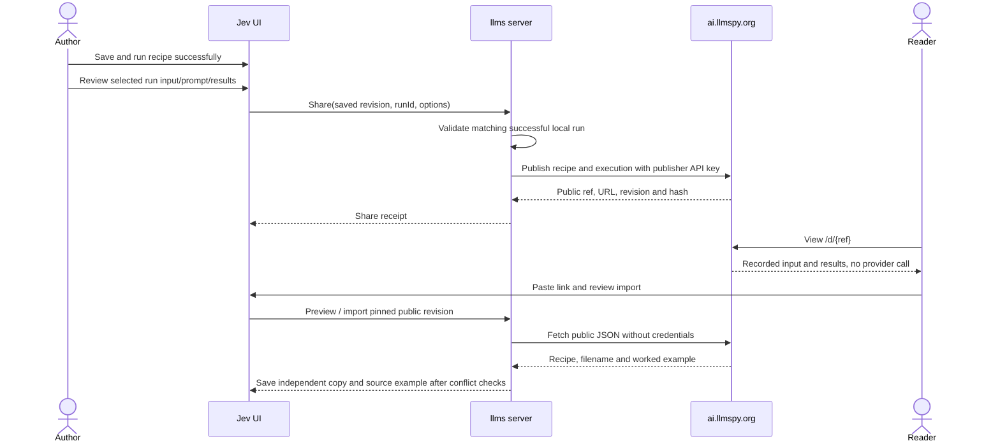

# Jev recipe sharing — implementation plan

Status: implemented in `ServiceStack/llms` and `ServiceStack/ubixar.com`; deployment remains
separate. Migration1010 adds the publication table. The code includes the executed-snapshot
publisher, public viewer/gallery, account handshake and source-pinned independent imports.

Verified with the shared Python/C# contract corpus, SQLite migration/lifecycle tests, Jev
regression tests and desktop/mobile light/dark browser checks against isolated fixture data.
PostgreSQL SQL generation is checked; a live round-trip test requires `JEV_TEST_POSTGRES`
pointing at a disposable database and creates/removes its own isolated schema. No production
migration or publication has been performed. See Jev’s [README](README.md) and ubixar’s
[release notes](/home/mythz/src/ServiceStack/ubixar.com/RECIPE_SHARING.md) for usage and rollout.

## 1. Scope and recommended behavior

Add recipe publishing through the existing llmspy publisher account, a public recipe
page at `https://ai.llmspy.org/d/{externalRef}`, and importing shared recipes into Jev.
Include a Recipes tab in the existing public gallery and in Jev's import dialog.
Use `/d` for decision recipes, reserving the generic `/r` namespace for other features.
Use `/publish/decision` for individual decision recipe APIs and `/publish/decisions`
for catalog and owner-management APIs.

The first release supports publishing an executed recipe with a worked example,
explicitly updating a share, copying its link, unpublishing, browsing, previewing,
downloading, and importing. A public viewer can inspect the recorded input prompt and
results immediately, without running Jev or connecting a provider. Importing creates an
independent editable local copy. It never establishes automatic synchronization.

Use these defaults:

- Local identity stays the filename stem: `sentiment.json` remains `sentiment` in
  Jev, history, and favourites. The portable document has no new ID or sharing fields.
- A publication gets a separate opaque public reference, following the existing
  thread/media reference convention. Its public link stays stable across updates.
  Filenames and recipe display names are not globally unique on the sharing server.
- Share only a validated saved recipe with a successful local execution of that exact
  recipe document. Select one qualifying run; its input, compiled prompt/state and
  normalized results are mandatory parts of the published snapshot. Pending, failed,
  cancelled, interrupted, or imported demonstration records do not qualify.
- Editing the recipe requires a new successful execution before sharing the changed
  version. An older run cannot be paired with an edited recipe. Changing only the current
  input form does not invalidate a selected run: its recorded input is what gets shared.
- The complete saved recipe, including all authored usage examples, is always included.
  Usage examples document the recipe and are separate from local run history. The preview
  displays the exact recipe and one selected execution input/prompt/results becoming public.
- Publishing includes only that selected execution's allowlisted public fields. Other
  history, raw provider responses, current unexecuted input, browser drafts, credentials,
  favourites, private paths and local storage metadata are excluded.
- Publishing and unpublishing do not change local history. Import replacement retains
  the existing filename conflict warning and clears only that recipe's old history
  after explicit confirmation of the current local revision.
- Every share is public and appears in the Recipes gallery. Private or unlisted shares,
  ratings, comments, public execution, attachments, and automatic updates are deferred.

## 2. Existing implementation to reuse

| Area | Existing code | Use in this feature |
| --- | --- | --- |
| Jev routes | [jev/__init__.py](/home/mythz/src/ServiceStack/llms/llms/extensions/jev/__init__.py) | Account-scoped routes, structured errors, bounded bodies, save/import handlers |
| Recipe contract | [schema.py](/home/mythz/src/ServiceStack/llms/llms/extensions/jev/schema.py) | Portable `schemaVersion: 1`, strict validation, 512 KiB document limit |
| Local persistence | [storage.py](/home/mythz/src/ServiceStack/llms/llms/extensions/jev/storage.py) | Filename identities, revisions, atomic writes, replacement/history rules |
| Execution records/results | [execution.py](/home/mythz/src/ServiceStack/llms/llms/extensions/jev/execution.py), [client.py](/home/mythz/src/ServiceStack/llms/llms/extensions/jev/client.py), [DecisionResults.mjs](/home/mythz/src/ServiceStack/llms/llms/extensions/jev/ui/DecisionResults.mjs) | Successful immutable run snapshots, normalized answers and existing result rendering |
| Jev UI | [JevPage.mjs](/home/mythz/src/ServiceStack/llms/llms/extensions/jev/ui/JevPage.mjs), [ImportRecipeDialog.mjs](/home/mythz/src/ServiceStack/llms/llms/extensions/jev/ui/ImportRecipeDialog.mjs) | Recipe actions, import preview, existing replacement confirmation and async selection guards |
| Publisher integration | [publish/__init__.py](/home/mythz/src/ServiceStack/llms/llms/extensions/publish/__init__.py), [publish/ui/index.mjs](/home/mythz/src/ServiceStack/llms/llms/extensions/publish/ui/index.mjs) | Connected account, registration, configured host, server-side bearer API key |
| Server DTOs/models | [Publish.cs](/home/mythz/src/ServiceStack/ubixar.com/MyApp.ServiceModel/Publish.cs) | ServiceStack publishing conventions, public projections and response status |
| Server services | [PublishServices.cs](/home/mythz/src/ServiceStack/ubixar.com/MyApp.ServiceInterface/PublishServices.cs) | Publisher identity, public reference generation, viewer shell and gallery patterns |
| Public UI | [index.html](/home/mythz/src/ServiceStack/ubixar.com/MyApp/wwwroot/llms/index.html), [medias.mjs](/home/mythz/src/ServiceStack/ubixar.com/MyApp/wwwroot/llms/medias.mjs) | Existing Vue ESM viewer, theme support, gallery tabs and pagination |
| Server infrastructure | [Configure.ApiKeys.cs](/home/mythz/src/ServiceStack/ubixar.com/MyApp/Configure.ApiKeys.cs), [Migration1009.cs](/home/mythz/src/ServiceStack/ubixar.com/MyApp/Migrations/Migration1009.cs) | API-key validation and OrmLite migration conventions |

Two account-linking issues must be addressed while extracting shared publisher helpers:

1. `get_publish_config()` currently reads the user's config before the default config,
   allowing the latter to overwrite it. A logged-in account must use its own publisher
   credentials; shared default credentials must not silently authorize another user.
   Preserve default-account publishing for the supported single-user/default mode.
2. The registration receiver accepts `register-success` without checking the message
   origin/source; the registration page sends credentials with `targetOrigin: "*"`.
   Pin the configured publisher origin and initiating popup/iframe on the client.
   Pass a validated caller origin to registration and use it as the reply target.
   Show the requesting host before granting credentials; a URL parameter alone is
   not authorization to disclose a key. Support local desktop/custom hosts through
   the same explicit origin handshake.

These changes require regression checks for existing thread/project/media account linking.
They do not require redesigning their publishing flows.

## 3. User flows

### Share from Jev

Add **Share recipe** to the recipe actions, with a share indicator/link for an already
published recipe. Open a dedicated `ShareRecipeDialog`, reusing the publisher account
connection component rather than the active chat/project selection.

The dialog shows the publisher account and host, filename, name, description, tags,
field/question counts, and a read-only preview with a JSON tab. Require a selected
successful local run matching the saved recipe document; default to the latest qualifying
run and allow choosing another matching run. Show its input, compiled prompt/state,
answers/probabilities, model and completion time together with the recipe.

If there is no qualifying run, publishing is unavailable with **Run this recipe first**
and an action returning to Run. Authored usage examples are included automatically as
recipe documentation; there is no examples opt-in. The selected execution cannot be omitted.
Explain that the recipe, its authored examples and the selected prompt, inputs and results
become public. Review occurs before the explicit publish action.

For a disconnected publisher, show **Connect account** and retain the preview while
registration completes. Browsing and importing public recipes require no publisher
connection; local authenticated account access still applies.

Publish states are **Not shared**, **Shared**, **Saved changes not shared**, and
**Publishing**. Successful publishing shows the URL, **Copy link**, and **Open page**.
An existing share offers **Update shared recipe** and **Stop sharing**. Updating retains
the link and requires the last known public revision. On a public revision conflict,
refresh its status and require review before attempting an update again.

Only saved, executed snapshots are published. If the editor is dirty, offer **Save and
run** or **Share saved version** when that saved version already has a qualifying run.
Saving alone cannot enable publishing. If edits occur during the upload, publish only
the captured executed snapshot and leave later edits marked as unshared. Updating a
share requires a qualifying execution for the version being uploaded too; selecting a
different successful run can update the public worked example without recipe edits.

Local deletion leaves a public share available. State this in the local delete dialog
when applicable, and provide **Stop sharing** separately. Users can also manage their
shares from the public gallery's **My recipes** view after local deletion or loss of
the local publication binding. Unpublishing removes the public page/download/catalog
entry; already imported copies remain usable. Republishing after removal creates a
new public reference instead of reactivating old links.

### Public viewing

`/d/{externalRef}` uses the existing viewer shell and a new `recipe.mjs` page. Display:

- Recipe name, description, tags, author, filename, publication/update dates and revision.
- The selected execution's input and prompt/state, followed by recorded answers,
  distributions and score/Choice/Noul displays, with model and completion time.
- Input fields, question types/instructions/criteria, presentation labels, and
  authored usage examples, plus a read-only recipe/publication JSON view.
- **Import into Jev**, **Copy link**, **Download JSON**, and **Browse recipes**.

Render the worked example immediately from the stored publication. Label it **Recorded
example result**; no Run button, API key, provider request or background evaluation is
needed. Result displays explain confidence as concentration rather than measured accuracy.
The public page remains usable after the author's local run/history has been deleted.

**Import into Jev** presents instructions to paste the share URL into Jev's import
dialog, with a copy action. This works with remote servers and desktop installations
without guessing a localhost port or requiring a native URI handler. Downloaded JSON
also works through the existing file import flow.

An optional later destination picker can open an explicitly chosen llms origin at
`/jev?import=<encoded-share-url>`. It must only open a preview, never import on arrival.
Jev does not currently have this query handling or a native recipe deep-link handler,
so neither is a dependency of the first release.

Add **Recipes** to `/m`, using `#recipes` like the existing audio/project tabs.
`/d` redirects there. Cards show name, summary, author, tags, question count and update
time. Support search, tag/author filters, newest/name ordering and bounded pagination.
An authenticated **My recipes** view includes owner controls for copying links and
unpublishing. Recipe results use their own projection, not media dimensions or reactions.

### Import into Jev

**Import recipe** has **Collection** and **From JSON** tabs. Collection searches the public
recipe catalog through the local server; built-in collection imports are removed.
From JSON imports a JSON export URL or JSON file. Viewer links on the publisher host
are normalized to `/d/{ExternalRef}.json`; other URLs must return a portable JSON export.

Collection entries link to the public page for viewing the recipe and worked result. Import
buttons and URL imports save directly, without a preview step. Preserve the published filename
by default; filename conflicts offer replacement or a copy with a different filename.

On import, pin the preview's public revision/hash and fetch that same current snapshot.
If the public recipe changed or was removed, stop and refresh the preview before any
local mutation. Validate it again locally, then use the existing storage import path.

If the filename exists, show the current replacement warning: replacing the recipe clears
its history. Offer **Replace**, **Import as a copy**, and **Cancel**. Replacement carries
the confirmed local `replaceRevision`; a concurrent local save must trigger a new warning.
Retained history for a deleted filename still needs the existing confirmation. Active
decisions block replacement until stopped. Preserve history sequence high-water counters.
If replacing a locally published recipe, explain that its existing public share remains
available and can be removed separately; the imported copy will not update that share.

After successful import, select the imported copy and refresh its library/history state.
Keep the recent UI behavior: no redundant "ready to use and edit" success notice.
Record source attribution as local metadata, without making the importer the publisher
or adding fields to the recipe JSON.

For link imports, retain the worked example in a separate local source-example sidecar
and display it as **Published example**, with an explicit action to copy its input into
the form. It is not a local execution or a history entry and cannot satisfy publishing
eligibility. New local results appear only after an explicit Run. Replacing/deleting a
recipe clears/replaces its source-example sidecar alongside its source metadata.
Pure recipe JSON downloads stay compatible with existing file imports and do not carry
recorded results; the share link/detail API carries the full publication.

## 4. ubixar.com API design

The following routes are implemented additions. Writes use `[ValidateApiKey]` and derive
the publisher from `Request.GetRequiredUserId()`; never accept ownership from the body.
Use standard ServiceStack `ResponseStatus` errors and field-level validation errors.

| Method and route | Access | Request / result |
| --- | --- | --- |
| `POST /publish/decision` | Publisher API key | Create from `{ filename, document, execution, idempotencyKey }`; successful execution package required |
| `PUT /publish/decision/{ExternalRef}` | Owning publisher API key | Replace snapshot with `{ filename, document, execution, revision }`; qualifying execution and conditional revision required |
| `DELETE /publish/decision/{ExternalRef}` | Owning publisher API key | Unpublish with expected `revision`; remove public access |
| `GET /publish/decision/{ExternalRef}` | Public | Metadata envelope including portable `document` and recorded `execution` |
| `GET /publish/decisions` | Public | Paged summaries; `q`, `tag`, `user`, `skip`, `take`, `orderBy` |
| `GET /publish/decisions/mine` | Publisher API key or authenticated owner session | Owner's active publication summaries for managing shares |
| `DELETE /publish/decisions/mine/{ExternalRef}` | Authenticated owner session | Same unpublish operation, with expected `revision`, for public gallery controls |
| `GET /d/{ExternalRef}` | Public | Human-readable viewer page |
| `GET /d/{ExternalRef}.json` | Public | Pure portable JSON with the stored filename as attachment name |
| `GET /d` | Public | Redirect to `/m#recipes` |

Use separate DTOs for API-key writes and browser-session management, sharing the same
ownership/revision service operation. Do not weaken API-key validation to accommodate
the gallery. Session mutations follow the site's existing CSRF protections. Admin
moderation is a separate authorized operation, not part of an anonymous endpoint.

Example successful create/update response:

```json
{
  "externalRef": "<public-reference>",
  "publishedUrl": "https://ai.llmspy.org/d/<public-reference>",
  "downloadUrl": "https://ai.llmspy.org/d/<public-reference>.json",
  "filename": "sentiment.json",
  "revision": 1,
  "contentHash": "<server-sha256-of-filename-document-and-execution>",
  "recipeHash": "<server-sha256-of-stored-document>",
  "publishedAt": "<UTC timestamp>",
  "updatedAt": "<UTC timestamp>",
  "author": { "userName": "<public-author-name>", "displayName": "<display-name>" }
}
```

Public detail adds `document` and the mandatory `execution`; catalog summaries add
derived name/description/tags, schema version, field/question/example counts, executed
model/time and public links. Never expose API keys, remote IPs, internal user IDs or
client idempotency keys through public projections.

### Required execution package

```text
execution:
  status: "succeeded"
  input: recorded form input matching document.inputSchema
  prompt: recorded request.state (text or object, as defined by document.state)
  answers: normalized typed answers for every document.questions key
  model: resolved provider model when available, otherwise the submitted model
  completedAt: UTC completion timestamp
  durationMs: optional nonnegative elapsed time
```

Jev constructs this package server-side from the selected account-owned history record.
Do not accept a browser-supplied execution/result object in the local share route.
`prompt` means the actual submitted Decisions API state, not a fabricated chat prompt;
questions/criteria come from the matching recipe snapshot. Raw response, usage/billing,
provider headers, local run IDs, leases and submission metadata remain private.

ubixar requires and validates the package on every create/update: successful status,
valid input, prompt equal to the document's compiled state, a complete matching answer
set, valid Noul probabilities, Choice options/distributions and Score ranges/legends,
finite numeric values, model and completion time. Reuse parity fixtures for Jev's
`normalize_answers()` rules. Missing/inconsistent execution is a 400 field error.
The server validates publisher-supplied execution data without re-running it; this is
not independent or cryptographic verification of a provider response.

### Validation and serialization

Implement `DecisionDocumentValidator` with the same schema-version, filename and document
rules as Jev. Share a positive/negative fixture corpus between Python and C# to prevent
drift. Validate all question types, state references, examples, presentation, supported
schema keywords, key restrictions and nesting limits. Reject unsupported future versions
with an actionable error; do not silently discard unknown fields.

Use `System.Text.Json`'s JSON DOM for document parsing, validation and writing, preserving
booleans, nulls, arrays, Unicode, numeric values and object structure. Avoid coercing the
portable document through loosely typed DTO conversion. Store the validated serialized
document and execution as text `DocumentJson` / `ExecutionJson` columns for consistent
PostgreSQL/SQLite round-tripping; keep catalog metadata in separate columns. No JSONB
querying is needed for the first release.

Enforce the existing 512 KiB document limit, a 2 MiB execution-package limit, and a
3 MiB publication-envelope limit before buffering/parsing, with bounded JSON depth.
Include encoded JSON escaping in these byte checks and apply a corresponding bounded
detail-response limit. Existing Jev's 512 KiB recipe request reader cannot simply be
reused for the publication envelope. Oversized executions cannot be silently truncated;
ask the author to run a smaller example instead.
Mirror portable filename checks, including the 245 UTF-8 byte limit, Windows reserved
names, invalid characters and path traversal. Preserve valid spaces, dots and Unicode.

The server computes `contentHash` over its serialized `{ filename, document, execution }`
publication payload, and `recipeHash` over the stored document alone. Both are authoritative;
clients need not reproduce .NET JSON serialization. Use publication revision/contentHash
ETags on public detail responses to pin both recipe and worked example during import.
Pure recipe downloads can use recipeHash ETags and contain only recipe JSON. Use safe
`Content-Disposition`, including `filename*` for Unicode, and reject header control characters.

### Persistence and consistency

Add `PublishedDecision` and a new migration using the next available migration number.
Follow the existing migration convention of freezing the table definition in the migration.

| Column | Purpose |
| --- | --- |
| `Id`, unique `ExternalRef` | Internal database identity and public reference |
| Indexed `PublishedBy` | Owner derived from authentication |
| `Filename`, `SchemaVersion`, `DocumentJson`, `RecipeHash`, `ExecutionJson`, `ContentHash` | Importable recipe, mandatory worked example and publication integrity |
| `ExecutedModel`, `ExecutedAt` | Derived execution summary for catalog/viewer |
| `Name`, `Description`, `Tags`, `QuestionCount`, `FieldCount`, `ExampleCount` | Validated, derived catalog projection |
| `Revision`, `PublishedAt`, `UpdatedAt`, nullable `UnpublishedAt` | Conditional updates and lifecycle |
| `CreateIdempotencyKey`, `CreateRequestHash` | Owner-scoped first-publish retry recovery |

Enforce a unique `(PublishedBy, CreateIdempotencyKey)` constraint. Keep enough creation
receipt data to return the original publication identity when a create response is lost;
a reused key with different create content is a conflict. A receipt never reactivates
an unpublished share. A key is an internal operation reference, not a recipe or filename ID.

Do not add unique constraints on filename, display name or content hash: two users can
share `sentiment.json`, and the same owner can intentionally share independent copies.
Update a row in place using an atomic `WHERE Revision = expectedRevision` operation.
Increment the public revision for a changed filename/document/execution; identical updates are
a no-op. Unpublish is conditional too, so a stale action cannot revoke an unexpected
new version. Exclude unpublished rows from all anonymous reads and catalog queries.

Keep creation and update timestamps distinct. Use deterministic pagination tie-breakers
and allowlisted search/order fields; cap `take` at 50. Public viewers and JSON responses
must revalidate caches after unpublish; never issue immutable long-lived cache headers.
Tombstones keep revoked references reserved. Revocation prevents future server fetches,
but cannot retract copies people already downloaded.

Return 400 for invalid content, 401 for missing/invalid credentials, 403 for unauthorized
ownership actions, 404 for unavailable public references, 409 for revision/idempotency
conflicts, 413 for oversized bodies, and 429 for publishing/query rate limits. Bound
publisher storage and request rates with existing hosting controls or explicit quotas.
Do not send stack traces in public failures.

## 5. llms/Jev server design

Extract a small reusable publisher client/config service from the publish extension.
Jev uses that service for authenticated publishing and anonymous public fetches. Keep
keys in the existing per-user `publish/config.json`; expose only masked account status
to the browser. Use existing registration and API-key validation, with the isolation
and message-origin corrections described above. If publish is disabled, Jev remains
usable and sharing shows a clear unavailable state.

Put orchestration in a new `jev/sharing.py`, leaving `schema.py` and decision execution
independent of publishing. Suggested Jev extension-relative routes:

| Method and path | Behavior |
| --- | --- |
| `POST runs/{id}/example-name` | Summarize an owned successful run into an editable example label using `defaults.summarize`; no history mutation |
| `GET recipes/{id}/share` | Connected account, saved revision, publication status and matching successful run summaries / ineligibility reason |
| `POST recipes/{id}/share` | `{ revision, runId, publishedRevision? }`; publish the executed snapshot or update its bound share |
| `DELETE recipes/{id}/share` | Unpublish the bound share at its expected public revision |
| `GET shared-recipes` | Proxy bounded public catalog queries to the configured host |
| `POST shared-recipes/preview` | `{ url }`; normalize a supported link, fetch and validate public detail |
| `POST shared-recipes/import` | `{ externalRef, publishedRevision, contentHash, filename, replaceRevision? }`; pin source, validate and save locally |

All local routes use `ctx.assert_username(request)` and account-scoped storage. Local
publishing checks the submitted saved revision, selected run ownership, `succeeded`
status, valid complete answers and equality of the saved document with `run.recipe`, excluding usage examples. Examples are
documentation; adding a recorded output must not force another paid execution.
Ownership here means membership in the authenticated user's store; the run's internal
`owner` field identifies its executor lease, not the user account.
Publish the complete validated document, including authored usage examples; revision
numbers alone cannot prove that the executed document matches. Runs for another
filename, unsaved drafts, deleted records or imported source examples are ineligible.
A matching successful run from an earlier revision can qualify when the document excluding examples
is identical, such as after reverting changes. Import routes do not dispatch provider calls.

Return actionable field errors for missing/non-successful/stale executions and disable
the publish action in the UI too. Always recheck eligibility server-side, including
updates; calling the route directly cannot bypass the execution requirement.

For remote fetches, accept only viewer/download links on the configured publisher
origin, extract the public reference, and construct known API paths internally. Reject
userinfo, foreign origins, arbitrary paths and off-origin redirects. Never fetch an
unrestricted pasted URL. HTTPS is the production default; allow a local test publisher
only through explicit server configuration. Set connection/read/total timeouts, bounded
response sizes, limited pagination and validate content/status before local writes.
Do not forward the publisher bearer key on anonymous import/catalog requests.

### Local metadata and network boundaries

Recover older pending snapshots exactly as captured, including any omitted examples, so
idempotency and receipt recovery remain valid. An explicit update then publishes the complete
recipe documentation at the same public link. Older receipts that excluded examples are
marked as having saved content not yet shared.

Store publication/source metadata in `jev/index.json`, not inside recipe files or
history records. Extend the existing recipe metadata with:

```text
publication:
  baseUrl, publisherAccount, externalRef, publishedUrl, publicRevision, contentHash
  savedRevision, savedDocumentHash, sourceRunId, includeAdditionalExamples (legacy receipt marker; true for new shares)
pendingPublication:
  account/host binding, idempotencyKey, captured revision/hash/run, pendingPayloadRef
importSource:
  baseUrl, externalRef, publishedUrl, author, publicRevision, contentHash, importedAt, exampleRef
```

An imported copy gets `importSource` but no `publication` binding. Duplicating a recipe
does not copy its publication binding. Sharing an imported or duplicated recipe creates
the current user's own publication after its own successful local execution; it cannot
update the original author's share or reuse that author's published result as local evidence.
Changing publisher account or host must not reuse the previous account's binding.

Before a new share, validate the saved recipe and qualifying run, reserve the pending
idempotency key, and capture the document/input/prompt/answers under the existing short
storage lock. Release the lock before any network request. Deleting the local history
after this capture does not alter the already validated in-flight publication.
Persist the exact complete filename/document/execution payload in a bounded private pending journal
under `jev/`, referenced by `pendingPayloadRef`; a hash alone cannot recover a snapshot
after the local file changes. Clean the payload up when its outcome has been reconciled.
Retries use the same pending key and captured snapshot until their outcome is resolved.
A later edit is not silently substituted into a pending create. After success, reacquire
the lock to record the remote receipt against that snapshot only if its reservation still
belongs to the same local recipe. Ordinary edits keep the reservation; deletion/replacement
detach it. Preserve concurrent edits; do not recreate a deleted file or bind a late receipt
to a replacement imported into the same filename. The returned share remains manageable
through **My recipes** even if local receipt recording fails.

If an update response is lost, fetch the current public revision/hash and reconcile it
with the submitted payload before offering another update. Never overwrite a newer remote
version as an automatic retry. Treat an already unpublished reference as a successful
reconciliation of a lost unpublish response, after checking the owner receipt.

For imports, fetch and validate the pinned document/execution outside the lock, then
acquire the lock for normal filename/revision checks, atomic save and confirmed history
clearing. Keep source attribution/example sidecar updates in that same local transaction.
Do not manufacture a succeeded local history record from the remote execution.
Replacement must clear any old publication binding because the incoming recipe is an
independent copy, while leaving
the old public share available for explicit management. Local recipe edits keep their
binding and mark the saved revision as changed; they never push automatically.

Remote failures leave recipe files, metadata revisions and history untouched. Translate
publisher authentication errors into **Reconnect account**; preserve revision conflicts
for review and use `StudioNotice` for actionable errors. Component requests retain the
existing selection/account guards so late replies cannot select or overwrite another draft.

## 6. Public UI and trust boundaries

Add `recipe.mjs` and a reusable recipe card/preview component under ubixar's existing
`wwwroot/llms/` viewer. Reuse its Vue ESM modules, themes, identity display and gallery
layout. Extract the viewer-shell helper from `PublishServices` if needed so the new
service does not duplicate HTML assembly. Regenerate ServiceStack JS DTOs for the
new services using the repository's existing DTO generation process.

Render recipe strings as escaped text. The new page should fetch its JSON detail
through the API rather than interpolate raw user-supplied JSON into an HTML script.
Handle descriptions/criteria containing `</script>`, HTML and prototype-like keys
without script execution. Generate escaped page titles/description metadata server-side.
Do not evaluate schema strings, templates, scripts or remote references. The public
viewer has no provider key and cannot run decisions.

Recipe rendering should be a small read-only component, not a second recipe editor.
Extract/reuse the presentation portion of `DecisionResults.mjs` for recorded answers,
without its run/cancel controls, empty Run prompt or raw-response view. Imported public
examples and local executions have separate state, labels and provenance. Use the same
contract/result fixtures for Jev and the public viewer, while avoiding copied
validators with different behavior. This feature does not touch the main chat model selector.



## 7. Implementation order and file changes

1. **Contract and fixtures:** finalize route/response DTOs, public revision semantics,
   execution eligibility/package, result validation, filename rules, limits and shared
   valid/invalid schema/result fixtures. Add the publisher isolation and registration-origin
   regression cases before reusing those helpers.
2. **ubixar backend:** add `MyApp.ServiceModel/PublishDecisions.cs`,
   `MyApp.ServiceInterface/DecisionPublishServices.cs`, `DecisionDocumentValidator.cs`,
   the next migration and `MyApp.Tests/DecisionPublishTests.cs`. Implement lifecycle,
   idempotency, ownership, mandatory execution validation, catalog/detail/download and
   session owner management. Persist the worked example with the public recipe.
3. **ubixar viewer:** add `wwwroot/llms/recipe.mjs` and recipe card/preview modules;
   extend `medias.mjs` with Recipes/My recipes, update generated DTOs, and use the
   existing viewer shell. Render recorded input/prompt and normalized results immediately
   without execution. Add public landing/navigation links where appropriate.
4. **llms publisher support:** extract reusable config/client/account-linking helpers
   under `extensions/publish/`; correct credential precedence and message handshakes
   on both repositories. Preserve existing publish route behavior.
5. **Jev server:** add `sharing.py`, route registration in `__init__.py`, and metadata
   methods in `storage.py`. Integrate source-pinned import with current replacement
   handling, source-example sidecars, server-side execution eligibility, account isolation,
   network limits and short lock lifetimes.
6. **Jev UI:** add `ShareRecipeDialog.mjs`; extend `ImportRecipeDialog.mjs`, recipe
   actions and API/state handling in `JevPage.mjs`. Reuse `StudioNotice` and existing
   controls/styles; add qualifying run selection, mandatory input/result review and
   recorded-result presentation. Verify desktop/mobile and light/dark layouts.
7. **Documentation and release:** document execution-required publishing, public inputs,
   prompts and results, additional examples, independent copies, filename collisions,
   explicit updates and unpublishing. Deploy the server
   migration/APIs/viewer before releasing the client. An older server returning 404
   should produce a clear sharing-unavailable message without affecting local Jev.

## 8. Verification and acceptance criteria

| Area | Required checks |
| --- | --- |
| Contract | All bundled recipes and normalized result types round-trip; positive/negative fixtures agree in Python/C#; preserve false, zero, null, arrays, Unicode and dotted filenames; reject missing execution, mismatched input/prompt/questions/answers, invalid probabilities, malformed/oversized/deeply nested and future-version documents |
| Ownership | Separate local accounts use separate publisher configs; two publishers can share the same filename/content; a non-owner cannot update/unpublish; public projections contain no internal credentials/identities |
| Eligibility | Never-run, pending, failed, cancelled, interrupted, other-account/other-filename, stale recipe and imported demo records cannot publish; edited recipe requires a matching new execution; valid matching success qualifies; both create and update enforce this on the local server |
| Lifecycle | Lost-create-response retry yields one share; changed content with the same idempotency key conflicts; concurrent updates/unpublish use revision checks; unchanged update is a no-op; changing only the selected run updates revision/hash/results; revoked links are unavailable; republishing creates a new ref |
| Sharing | Selected executed input/prompt/results always present and match the preview; authored usage examples always included; no unrelated history/current unexecuted input/raw response/credentials exposed; concurrent edit/delete/replacement remains safe; captured payload survives lost responses; account/host changes cannot target old bindings |
| Import | Public link and downloaded recipe JSON work; link import retains a separately labeled source example, never qualifying local history; same filename warns; confirm clears only matching history/source metadata; cancel preserves everything; copies avoid replacement; stale local/public revisions and active decisions block writes; counters remain intact |
| Network/rendering | Foreign URLs/off-origin redirects rejected; timeout/oversize/non-JSON errors leave local data intact; import fetches carry no API key; escaped malicious recipe strings cannot execute; Unicode download filename is safe |
| Public viewer/catalog | Recorded prompt/input/results appear immediately with no provider configuration or calls; local history deletion does not break public results; search/filter/order/pagination are bounded/stable; removed shares disappear; My recipes works after local deletion; mobile/dark/light/error states are usable |
| Regression | Existing Jev save/import/history and publisher thread/project/image/audio flows still pass; no provider calls occur while sharing, browsing or importing; verify migration and serialization on SQLite and PostgreSQL |

Run the Jev unit/model/browser checks and focused publisher regression checks in llms.
In ubixar, add isolated NUnit service/validator tests, migration/serialization tests,
and API/viewer integration checks against a development host. Use test publisher accounts
and temporary data; do not publish fixtures to the production gallery.

The feature is ready when one user can share only a successfully executed matching recipe
with its reviewed prompt/input/results, another can view the worked example without running
anything and import the original filename, conflicts behave like current imports, and the
author can update or remove the public link without altering either user's local history.

### Discovery follow-up

Implemented the public versioned `/publish/decisions/tags` catalogue with UI caching,
content/tag suggestions in the editor, and custom tags. Catalogue version 3 uses label-only
entries: the same label is displayed, selected, saved and returned by inference. Older
lowercase/hyphenated recipe values remain discoverable without changing portable snapshots. Publish/update snapshots now carry
`publisherStarred` and `publisherRunCount`, including journal recovery. The import browser
and public gallery support recommended/most-run ordering and tag filters. Run counts are
private sorting metadata; public responses omit them. Migration1011 adds usage columns.
Migration1012 stores community stars with a unique recipe/person pair. The total combines those
stars with the publisher favourite, counting the publisher at most once. Stars never change
the portable snapshot or public revision. Recommended sorts by total stars, then runs; Most run
sorts by runs, then stars. Public viewers, the gallery, and Jev Collection provide star controls.
